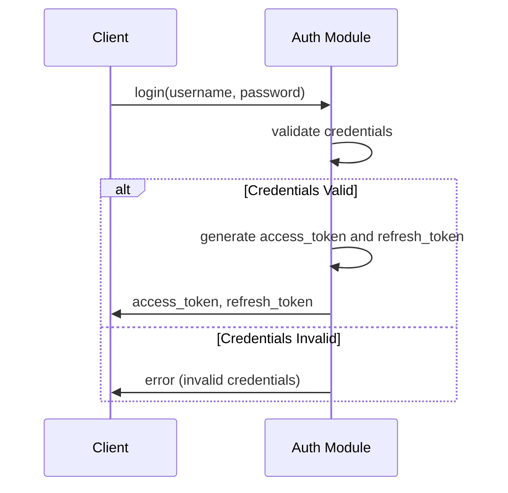
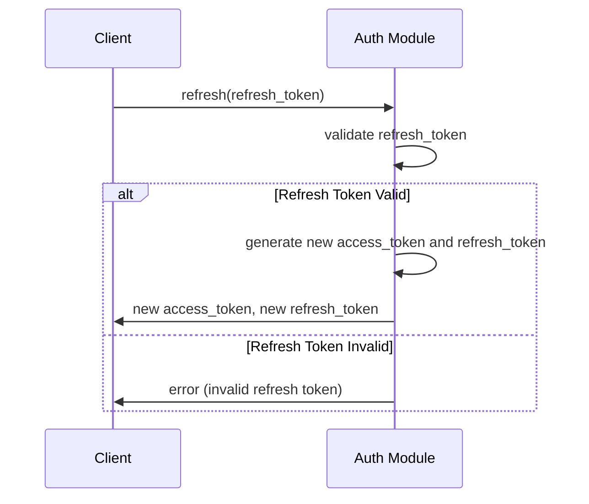

# Auth Service Module
This module is responsible for handling user authentication and authorization.

## Login and Token Refresh Process

### Login

```mermaid
sequenceDiagram
    participant client as Client
    participant auth as Auth Module
    client ->> auth: login(username, password)
    auth ->> auth: validate credentials
    alt Credentials Valid
        auth ->> auth: generate access_token and refresh_token
        auth ->> client: access_token, refresh_token
    else Credentials Invalid
        auth ->> client: error (invalid credentials)
    end

```

### Token Refresh

```mermaid
sequenceDiagram
    participant client as Client
    participant auth as Auth Module

    client ->> auth: refresh(refresh_token)
    auth ->> auth: validate refresh_token
    alt Refresh Token Valid
        auth ->> auth: generate new access_token and refresh_token
        auth ->> client: new access_token, new refresh_token
    else Refresh Token Invalid
        auth ->> client: error (invalid refresh token)
    end
```